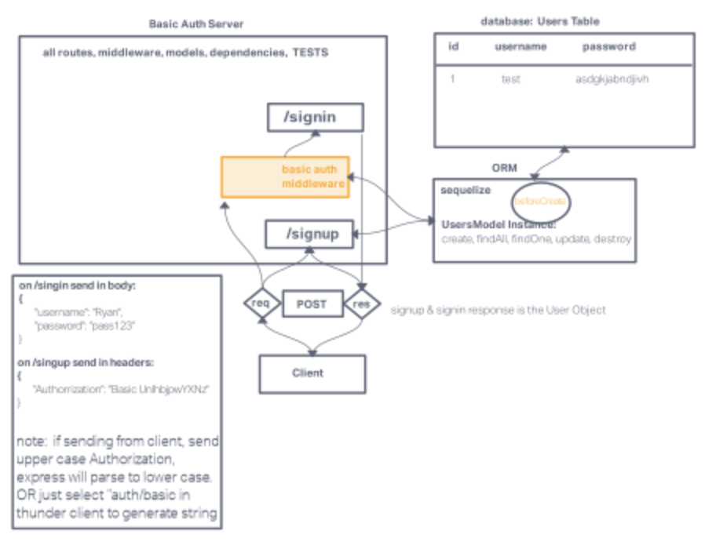

# Basic auth

## Author: Tricia Sawyer

### Project Overview

### Problem Domain

Deploy an Express server that implements Basic Authentication, with signup and signin capabilities, using a Postgres database for storage.

### Links and Resources

- [GitHub Actions ci/cd](https://github.com/triciasawyer/basic-auth/actions)
- [back-end prod server url](https://basic-auth-prod.onrender.com)

### Collaborators

Daniel Frey

### Setup

#### Environment Variables

Ensure you have the following environment variable defined in your `.env` file:

- `PORT`: Port variable to specify the server's listening port.

#### Initializing and Running the Application

To get the application up and running, follow these steps:

1. Clone the repository to your local machine.
2. Install project dependencies using `npm install`.
3. Start the server by running `nodemon` in your terminal.
4. To run tests, execute the command `npm test` in your terminal.

#### Routes

/signin
/signup

#### Tests

to run tests, after running `npm i`, run the command `npm test`

#### Deployed version

[Render deploy](https://basic-auth-prod.onrender.com)

#### PR

#### UML

- GitHub Actions: [View CI/CD Workflow](https://github.com/triciasawyer/basic-auth/actions)
- Backend Production Server: [Access Backend Server](https://basic-auth-prod.onrender.com)

### Links and Resources

- [GitHub Actions ci/cd](https://github.com/triciasawyer/basic-auth/actions)
-
- [back-end prod server url](https://basic-auth-prod.onrender.com)
