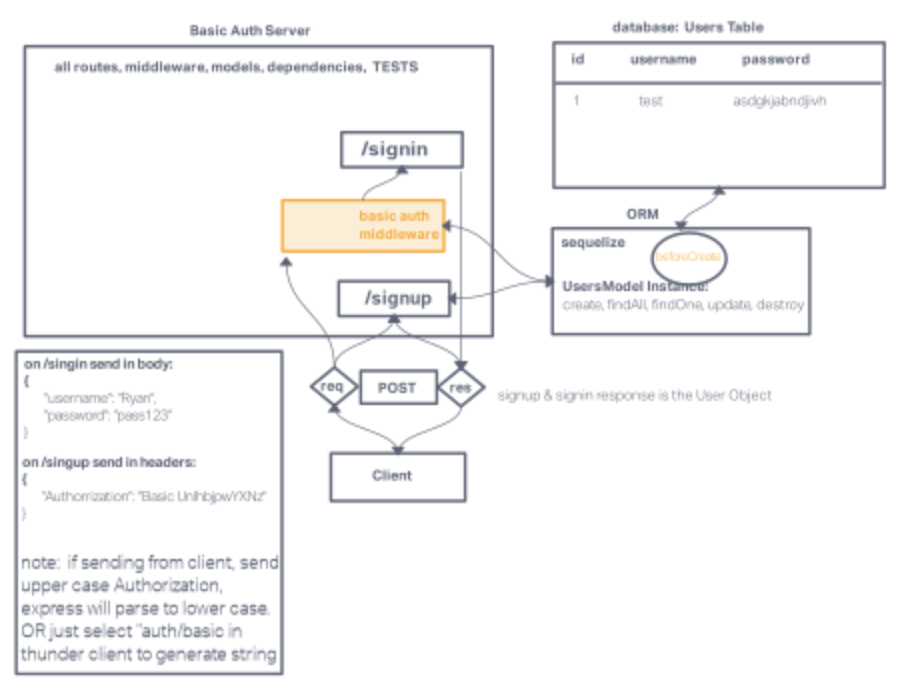

## Basic auth

### Author: Tricia Sawyer

### Problem Domain

Deploy an Express server that implements Basic Authentication, with signup and signin capabilities, using a Postgres database for storage.

### Collaborators

Daniel Frey

#### Deployed version

[Render deploy](https://basic-auth-prod.onrender.com)

#### Routes

/signin
/signup

### Setup

.env requirements (where applicable)
port variable exists within the env sample

How to initialize/run your application (where applicable)
clone repo, npm i, then run nodemon in the terminal

#### PR

[PR 1](dev)

#### UML Diagram

### Links and Resources

- [GitHub Actions ci/cd](https://github.com/triciasawyer/basic-auth/actions)
- 
- [back-end prod server url](https://basic-auth-prod.onrender.com)
